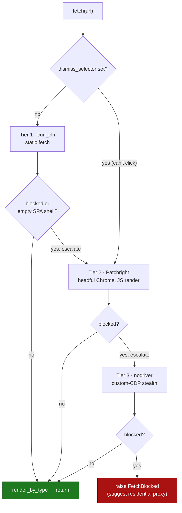

# web-fetch-mcp

**A web-fetch [MCP](https://modelcontextprotocol.io) server for LLM agents that
fails honestly — it raises `FetchBlocked` instead of silently handing your model
a CAPTCHA or login page as if it were the article.**

Naive fetchers poison an agent's context: when a site returns a JavaScript
interstitial or a login wall with HTTP 200, the agent reads the challenge page as
if it were content and reasons from garbage. `web-fetch-mcp` detects that and
either escalates to a stronger strategy or fails loudly.

> **Status:** early / alpha. The escalation logic and helpers are unit-tested,
> but real-world bypass rates are not yet benchmarked — see `assets/benchmarks.md`
> and the roadmap in `TODO.md`.

## How it works

A cheapest-first escalation ladder. Each tier targets a different layer of
bot-detection, and the server only pays for the expensive ones when it has to:

| Tier | Engine | Targets | Speed |
|------|--------|---------|-------|
| 1 | `curl_cffi` (Chrome TLS/HTTP2 fingerprint) | TLS (JA3/JA4) + HTTP/2 fingerprinting | ~500 ms |
| 2 | Patchright (real headful Chrome) | JavaScript fingerprinting; renders SPAs | ~1–3 s |
| 3 | nodriver (custom CDP) | automation-protocol (CDP) detection | ~2–4 s |

Every tier's output is checked for **hard blocks** (403/429/503) and **soft
blocks** (HTTP-200 challenge or login bodies served in place of content).
Transient failures retry with exponential backoff + jitter (honoring
`Retry-After`) before escalating. If everything is blocked, it raises
`FetchBlocked` with a remedy hint — it never returns a block page as content.

### Escalation path (`mode="auto"`)



Each tier runs through `with_retry` (exponential backoff + jitter, honoring
`Retry-After`) before the chain escalates. Tier 1 must clear the **strict** check
(not blocked **and** not an unrendered SPA shell); Tiers 2–3 only need to be
not-blocked. The single-tier modes (`static`/`dynamic`/`stealth`) run exactly one
box and skip the chain.

## Tools

- **`fetch`** — retrieve a page as `markdown` / `text` / `html` / `article`
  (main-content extraction via trafilatura). Non-HTML URLs are auto-handled:
  JSON is pretty-printed, PDFs are text-extracted, images return a note to use
  `screenshot`.
- **`screenshot`** — render a page in real Chrome and return a PNG.

## Architecture

A layered package (`src/web_fetch_mcp/`), dependencies pointing inward:

```
controller  (FastMCP tools, lifespan)        controller/app.py
   -> service   (retry decorator, strategy registry, escalation, facade)
        -> accessor  (curl_cffi / Patchright / nodriver, BrowserManager)
             -> core   (models, config, detection, rendering, proxy, backoff)
```

- **Strategy** — the three tiers are interchangeable `async (request) -> FetchResult`
  callables in a registry (`service/strategies.py`).
- **Chain of Responsibility** (intent) — `auto` mode walks the tiers cheapest-first,
  escalating until one yields usable content (`service/escalation.py`).
- **Decorator** — `with_retry` adds exponential-backoff + Retry-After to any tier
  (`service/retry.py`), hand-rolled on the stdlib (no `tenacity`).
- **Manager** — `BrowserManager` owns one reused Chromium and closes it on the
  FastMCP lifespan shutdown (`accessor/browser.py`).

## Quickstart

```bash
uv sync
uv pip install -e .        # installs the `web-fetch-mcp` console command
web-fetch-mcp              # run the stdio MCP server
```

Register it with any MCP-compatible client as a stdio server that runs the
`web-fetch-mcp` command (or `python -m web_fetch_mcp.controller.app`).

```python
fetch("https://example.com/article", output="article")   # clean main content
fetch("https://api.site/data.json")                       # pretty-printed JSON
fetch("https://spa.example.com", mode="dynamic")          # force a JS render
```

## Responsible use

This tool is for fetching content you are **authorized** to access. You are
solely responsible for complying with each site's Terms of Service, `robots.txt`,
and applicable law. It honors `Retry-After` and backs off by default; please
rate-limit responsibly. It does **not** solve CAPTCHAs or bypass authentication
you do not hold. Provided **as-is, without warranty**.

## License

[Apache-2.0](LICENSE).
